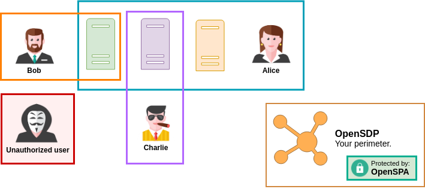
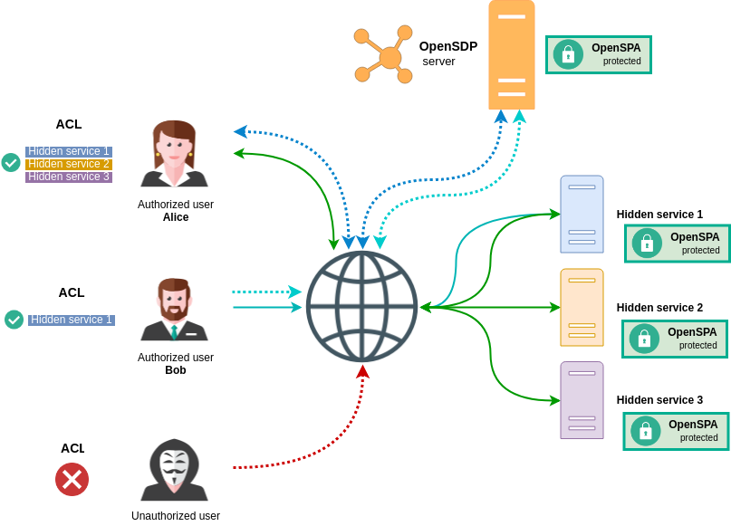

# OpenSDP
A proof of concept [Software Defined Perimeter (SDP)](https://en.wikipedia.org/wiki/Software_Defined_Perimeter) implementation using OpenSPA for service hiding.

## How It Works
Currently being a PoC, OpenSDP supports only service discovery for [OpenSPA](https://github.com/greenstatic/openspa) protected services.

* Each service is protected by an OpenSPA server
* Clients not knowing where OpenSPA hidden services are contact the OpenSDP server for service discovery over mutual TLS
* Clients are then free to perform the OpenSPA handshake with all services that they are authorized

Currently it's only possible to define services and the clients ACL using a series of YAML files.
This is planned to change in the coming releases.

## Setup
TODO

## TODO
- [ ] Add logging to server
- [ ] Add timeout if HTTP request is taking too long

## License
This software is licensed under: [GNU General Public License v3.0](https://www.gnu.org/licenses/gpl-3.0.en.html).
